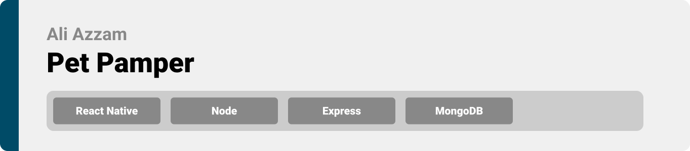

<div align="center">

> Hello world! This is the project’s summary that describes the project plain and simple, limited to the space available. 

**[PROJECT PHILOSOPHY](https://github.com/julescript/well_app#-project-philosophy) • [WIREFRAMES](https://github.com/julescript/well_app#-wireframes) • [TECH STACK](https://github.com/julescript/well_app#-tech-stack) • [IMPLEMENTATION](https://github.com/julescript/well_app#-impplementation) • [HOW TO RUN?](https://github.com/julescript/well_app#-how-to-run)**

</div>

<br><br>


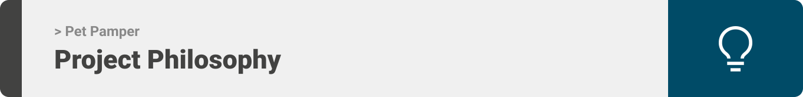

> Pet Pamper mobile app is a solution that offers quick access to any veterinary or pet shop nearby which helps pet owners. It assist users with the mundane pet walking experience by giving access to variety of pet-walking communities nearby. 
> 


### User Stories
- As a pet owner, I want someone to join me during my pet-walking time, so that I don't get bored.
- As a pet owner, I want to join nearby pet-walking communities to walk with, so that I can meet new people.
- As a pet owner, I want to locate nearby veterinaries within 1 km radius, so that I can visit regularly to check up on my pet's health or incase of emergencies.
- As a pet owner, I want to locate nearby pet shops within 1 km radius, so that I can visit regularly to buy pet products.


<br><br>

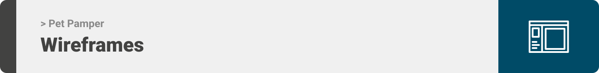

> This design was planned before on paper, then moved to Figma app for the fine details.
Note that I didn't use any styling library or theme, all from scratch and using pure CSS modules

| Home  | Discover  |
| -----------------| -----|
| 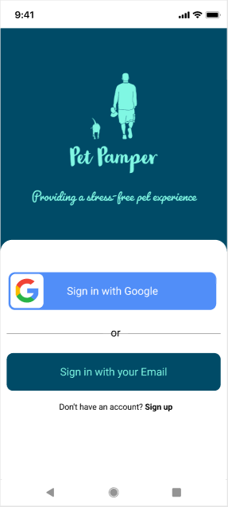 | 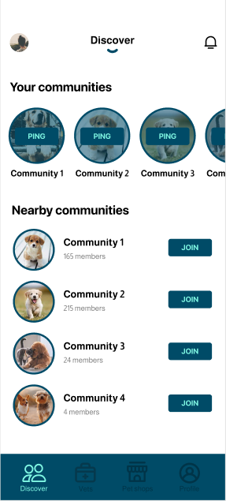 |

| Veterinary  | Pet shop  |
| -----------------| -----|
| 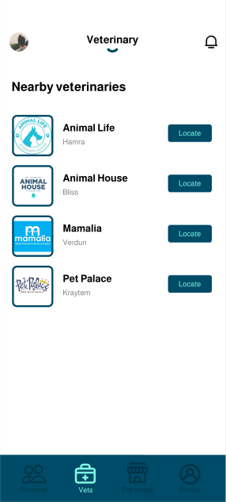 | 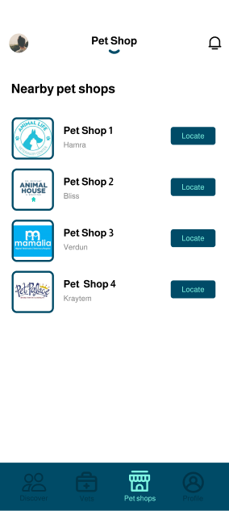 |

| User profile  | Notifications  |
| -----------------| -----|
| 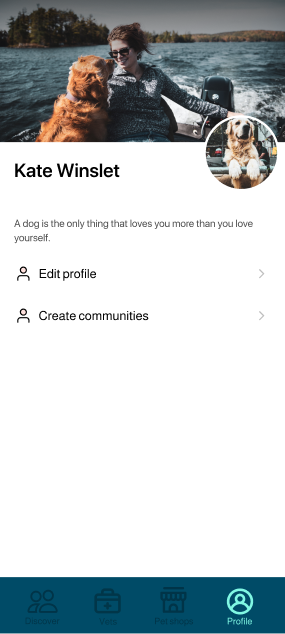 | 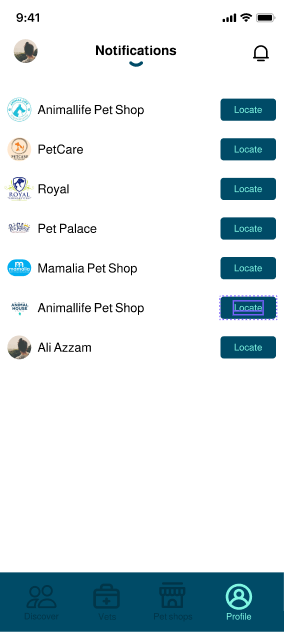 |

<br><br>

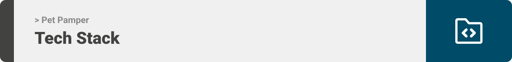

Here's a brief high-level overview of the tech stack the Well app uses:

- This project uses the [React Native app development framework](https://reactnative.dev/). React Native combines the best parts of native development with React, a best-in-class JavaScript library for building user interfaces.
- This project uses the [Node development framework](https://nodejs.org/). As an asynchronous event-driven JavaScript runtime, Node.js is designed to build scalable network applications.
- This project uses the [Express development framework](https://expressjs.com/). Express is a minimal and flexible Node.js web application framework that provides a robust set of features for web and mobile applications.
- For persistent storage (database), the app uses [MongoDB](https://www.mongodb.com/) which allows the app to create a custom storage schema and save it to a local database.


<br><br>
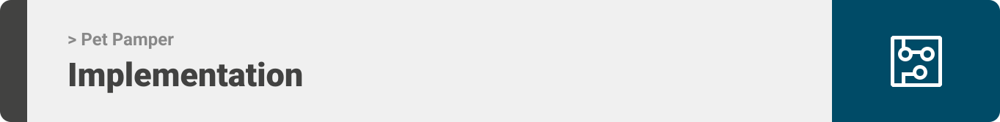

> Using the above mentioned tech stacks and the wireframes build with Figma from the user stories we have, the implementation of the app is shown as below, these are screenshots from the real app

| Home  | Discover  |
| -----------------| -----|
| 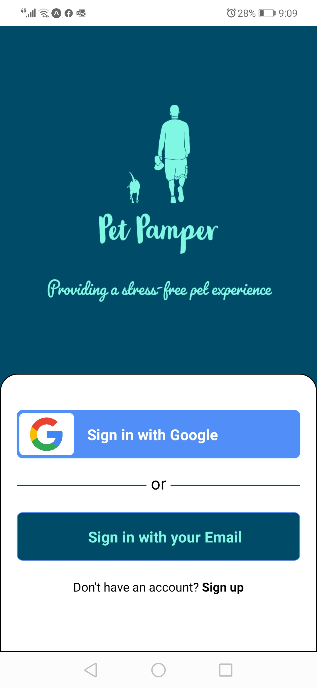 | 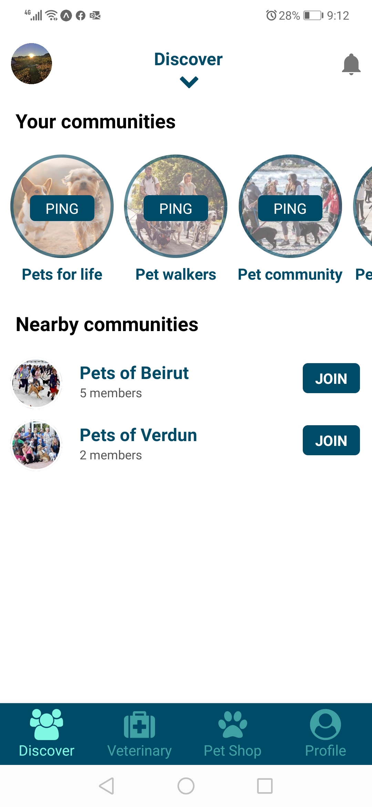 |

| Veterinary list  | Veterinary map  |
| -----------------| -----|
| 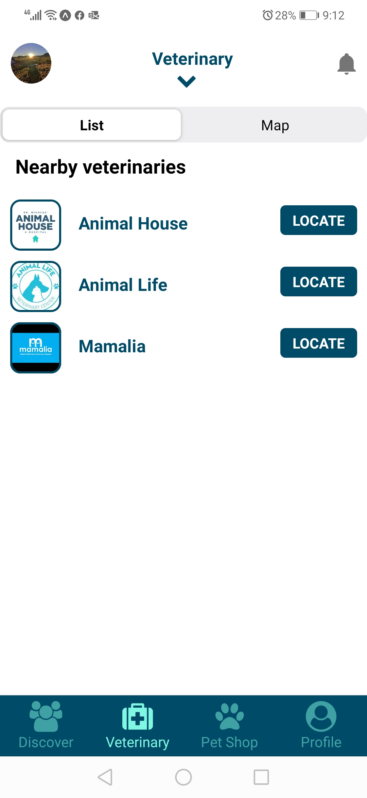 | 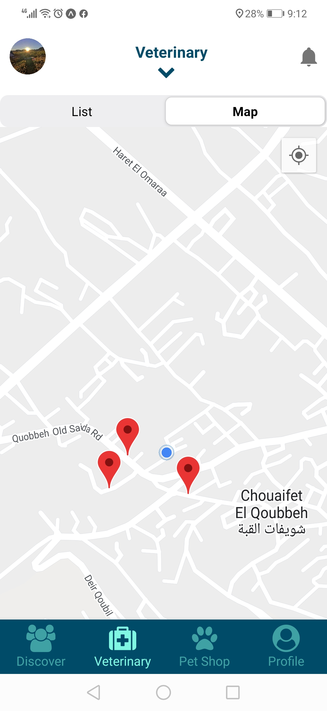 |

| Pet shop  | User profile  |
| -----------------| -----|
| 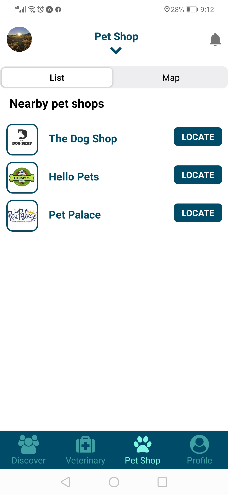 | 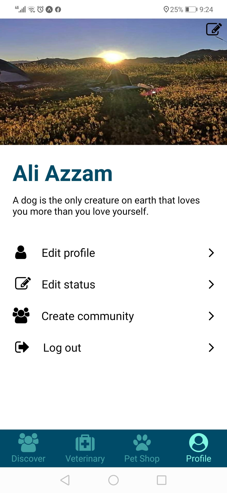 |

<br><br>


> This is an example of how you may give instructions on setting up your project locally.
To get a local copy up and running follow these simple example steps.

### Prerequisites

This is an example of how to list things you need to use the software and how to install them.
* npm
  ```sh
  npm install npm@latest -g
  ```

### Installation

_Below is an example of how you can instruct your audience on installing and setting up your app. This template doesn't rely on any external dependencies or services._


1. Clone the repo
   ```sh
   git clone https://github.com/AliAzzam91/pet_pamper_project.git
   ```
2. Install NPM packages
   ```sh
   npm install
   ```

|Backend|
|-------------| 

3. Create a package.json file for your application
   ```js
   npm init
   ```
4. Install Express
   ```js
   npm install express
   ```
5. Install body parser, dotenv, and mongoose packages
   ```js
   npm install body-parser mongoose dotenv  
   ``` 
|Frontend|
|-------------| 

6. Install Expo CLI
   ```js
   npm install -g expo-cli
   ``` 
7. Install Redux to manage states
   ```js
   npm install redux redux-thunk react-redux
   ``` 
8. Install icon libraries
   ```js
   npm install --save react-native-vector-icons react-native-paper
   ``` 
9. Install location packages
   ```js
   expo install expo-location geolib
   ``` 
10. Install picker to select account type
      ```js
      npm install @react-native-picker/picker
      ``` 
11. Install Expo linking to deep link to google maps
      ```js
      expo install expo-linking
      ``` 
12. Install react native maps for map view
      ```js
      npm install react-native-maps
      ``` 
13. Install segmented controller
      ```js
      npm install @react-native-segmented-control/segmented-control
      ``` 
14. Install image picker
      ```js
      expo install expo-image-picker
      ``` 
15. Install bottom tabs navigation
      ```js
      npm install react-navigation-material-bottom-tabs
      ``` 


